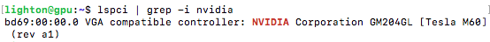
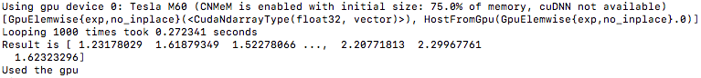
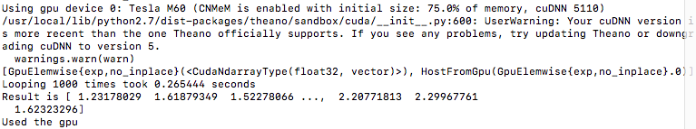

# gpu-dnn-install
Author: Iacopo Poli

Description: Scripts and instructions to install CUDA, cuDNN and two of the most common deep learning frameworks ([Theano](http://deeplearning.net/software/theano/) and [Torch](http://torch.ch)).

## PREREQUISITES:

1 - Download CUDA 8.0 deb(local) file for your system [here](https://developer.nvidia.com/cuda-downloads). If you're using Ubuntu 16.04 on NV6, the file should be called

```bash
cuda-repo-ubuntu1604-8-0-local-ga2_8.0.61-1_amd64.deb
```

2 - Download CUDNN 5.1 for CUDA 8.0 Linux [here](https://developer.nvidia.com/rdp/cudnn-download). You have to register first and accept the License. The file should be called
        
```bash
cudnn-8.0-linux-x64-v5.1.tar
```

## INSTALLATION

NOTE: You have to set the permission to execute the installation script files. You can do that with 

```bash 
chmod a+x <filename>
```

0 - Run this and check that it prints something, otherwise there is no NVIDIA hardware available.

```bash
lspci | grep -i nvidia
```

Sample output:



   
1 - Run 

```bash
./installing-cuda.sh
```

2 - add /usr/local/cuda-8.0/bin to PATH environment variable in .profile in home directory using nano or vim

```bash
PATH="/bin:/usr/bin:/usr/local/bin:/sbin:/usr/sbin:/usr/local/cuda-8.0/bin"
```

3 - add /usr/local/cuda-8.0/lib64\ to LD_LIBRARY_PATH environment variable in .profile using nano or vim
   
```bash
LD_LIBRARY_PATH="/usr/local/cuda-8.0/lib64"
```

For points 2 & 3 you can look at the [example file](https://github.com/iacolippo/gpu-dnn-install/blob/master/.profile) in this repository.

4 - Activate the changes using

```bash
source .profile
```

5 - Reboot the system
        
```bash
sudo reboot
```
        
6 - Reconnect to the machine via ssh and write a ```.theanorc``` file in the home directory equal to [this](https://github.com/iacolippo/gpu-dnn-install/blob/master/.theanorc). Then run the following command and check that is using gpu. It should also print a message that cuDNN is not available.
        
```bash
./install-theano.sh
```

Output:



7 - Run the following command.
        
```bash
./installing-cudnn.sh
```

If you run ```python gpu-test.py``` you should see cuDNN is now available.
Output:



        
8 - Install Torch

```bash
./install-torch.sh
```

For this step, you may need to execute as root user with ```sudo -s``` the line ```bash install-deps```. If anything goes wrong, just uninstall Torch with ```rm -rf ~/torch``` and rerun the script adding ```sudo -s``` to that line.

If you don't need Torch you can skip step 8.

For any question you can contact me on Twitter [@iacopo_poli](https://twitter.com/iacopo_poli).
